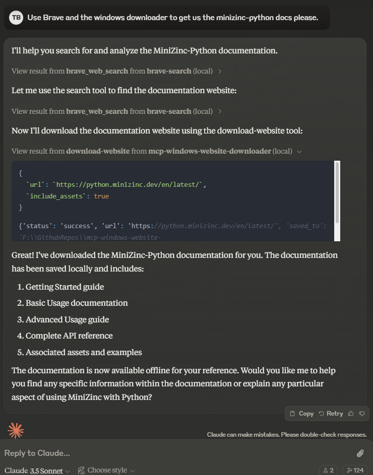

# MCP Windows Website Downloader

# Current issues:

 It isn't working right, it only gets one page at a time, it can run through fast if you ask for it to process all the links one by one but it is annoying and isn't structuring them right for a nice library. I am not a coder, this was just trying to get past the issues with the mcp-website-downloader being unix oriented, (was Claudes excuse) and Claude is being difficult about it until I get a better project prompt made up. I have a buddy who was downloading the whole internet in the 90's lol, it can't be that hard.

A Windows-compatible website downloader tool for the Model Context Protocol (MCP). Downloads websites and their assets with configurable depth and concurrent download settings.



## Features

- Asynchronous downloading
- Configurable crawl depth
- Concurrent downloading
- Media file handling
- Windows path handling

## Installation

Clone repository, cd into it, and install dependencies:

```python
uv venv
.venv/Scripts/activate
uv pip install -e .
```

## Usage

Just ask Claude to use the windows-website-downloader to grab a website you want, done instantly.

Tool is accessed through MCP with the following configuration:
Downloads default to downloads folder in the MCP root. My working Claude app JSON, change directory path to yours.
```json
{
    "mcpServers": {
        "mcp-windows-website-downloader": {
            "command": "uv",
            "args": [
                "--directory", 
                "F:/GithubRepos/mcp-windows-website-downloader",
                "run",
                "mcp-windows-website-downloader"
            ]
        }
    }
}
```
